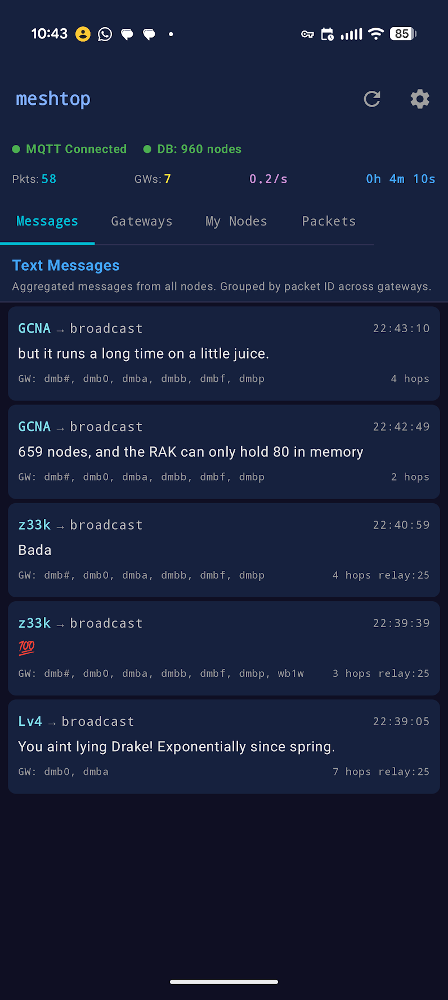
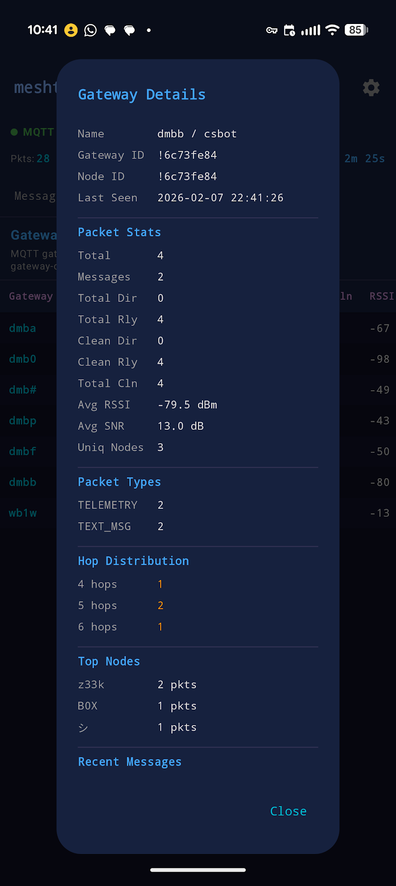
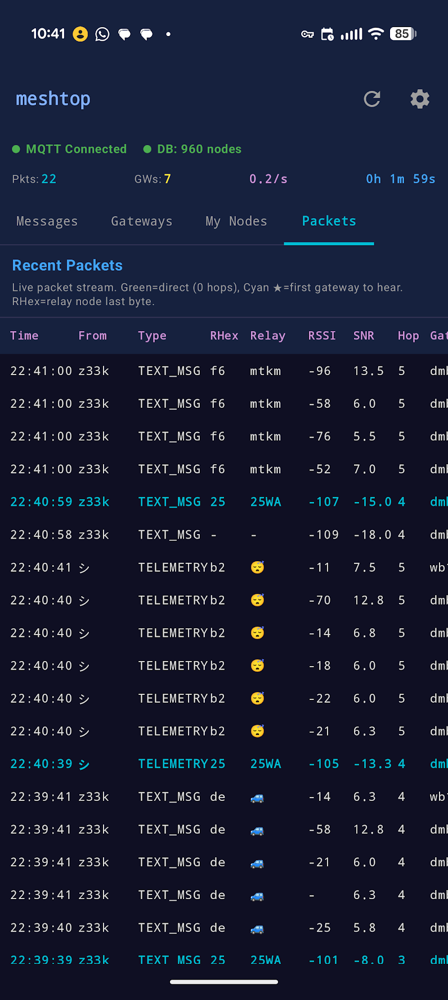

# meshtop for Android

An Android app for monitoring Meshtastic mesh networks via MQTT. Provides real-time visibility into gateway performance, node activity, packet flow, and text messages across the mesh.

## Features

- **Real-time MQTT monitoring** - Connects to any Meshtastic MQTT broker and processes mesh traffic live
- **AES-128-CTR decryption** - Decrypts encrypted packets using the standard Meshtastic LongFast key
- **Four tabbed views:**
  - **Messages** - Text messages grouped by packet ID across gateways, showing sender, recipient, gateway, hops, and signal quality
  - **Gateways** - Gateway performance table with packet counts, direct/relayed ratios, average RSSI/SNR, and unique node counts
  - **My Nodes** - Detailed stats for your tracked nodes including direct vs relay counts, signal averages, and gateway coverage
  - **Packets** - Raw packet feed with port type, signal data, hop count, and relay node disambiguation
- **Relay node disambiguation** - Resolves ambiguous single-byte relay node IDs using proximity-based scoring (ported from the Python implementation)
- **Background operation** - Foreground service with wake lock keeps MQTT connected when the screen is off
- **Text message notifications** - Heads-up notifications for incoming mesh messages with sender, gateway, and signal info
- **Optional PostgreSQL database** - Load node names from an existing Meshtastic database for immediate name resolution instead of waiting for NODEINFO packets
- **Dark terminal aesthetic** - Color-coded UI inspired by the original TUI

## Screenshots

| Messages | Gateway Details | Packets |
|----------|----------------|---------|
|  |  |  |

## Setup

1. Install the APK or build from source
2. Open the app and tap the gear icon to configure:
   - **MQTT Broker** - Your Meshtastic MQTT server hostname
   - **Port** - MQTT port (default: 1883)
   - **Username/Password** - MQTT credentials (if required)
   - **Topic** - MQTT topic filter (e.g. `msh/US/2/e/LongFast/#`)
   - **My Nodes** - Comma-separated short names of your nodes to track
3. Optionally configure PostgreSQL database settings for node name resolution (see below)
4. Tap "Save & Reconnect"

## PostgreSQL Setup (Optional)

Without a database, meshtop resolves node names by listening for NODEINFO packets over MQTT. This works but can take a while — you won't see names for nodes that haven't broadcast their info since you started listening. Connecting to a PostgreSQL database pre-populates all known node names at startup.

### Table Schema

The app reads from a single `node_info` table:

```sql
CREATE TABLE node_info (
    node_id    BIGINT PRIMARY KEY,   -- Meshtastic numeric node ID (e.g. 2714370749)
    short_name VARCHAR(10),          -- 4-char short name (e.g. 'dmbw')
    long_name  VARCHAR(40),          -- Full name (e.g. 'DMB West')
    hex_id     VARCHAR(10)           -- Hex ID as shown in MQTT gateway IDs (e.g. '!a1c5e33d')
);
```

The app runs this query at startup:

```sql
SELECT node_id, short_name, long_name, hex_id
FROM node_info
WHERE short_name IS NOT NULL AND short_name != '';
```

### App Settings

In the Settings screen, fill in the **PostgreSQL** section:

| Field | Description | Example |
|-------|-------------|---------|
| DB Host | PostgreSQL server hostname or IP | `db.example.com` |
| DB Port | PostgreSQL port (default: 5432) | `5432` |
| DB Name | Database name | `meshtastic` |
| DB User | Database username | `meshreader` |
| DB Password | Database password | `secret` |

The connection is read-only — the app never writes to the database.

### Populating the Table

The `node_info` table can be populated in several ways:

**1. Manual insertion** — Add nodes you know about directly:

```sql
INSERT INTO node_info (node_id, short_name, long_name, hex_id) VALUES
    (2714370749, 'dmbw', 'DMB West', '!a1c5e33d'),
    (2714370921, 'dmbs', 'DMB South', '!a1c5e3e9');
```

**2. From the Meshtastic firmware database** — If you run a Meshtastic device with a PostgreSQL logger module, it may already maintain a node table. Create a view or copy the data:

```sql
CREATE VIEW node_info AS
SELECT
    num AS node_id,
    short_name,
    long_name,
    '!' || lpad(to_hex(num), 8, '0') AS hex_id
FROM nodes
WHERE short_name IS NOT NULL AND short_name != '';
```

**3. MQTT listener script** — Run a script that subscribes to MQTT, parses NODEINFO packets, and upserts into the table:

```sql
INSERT INTO node_info (node_id, short_name, long_name, hex_id)
VALUES ($1, $2, $3, $4)
ON CONFLICT (node_id) DO UPDATE SET
    short_name = EXCLUDED.short_name,
    long_name  = EXCLUDED.long_name,
    hex_id     = EXCLUDED.hex_id;
```

**4. From meshtastic-mqtt-json or similar collectors** — Various community tools log mesh traffic to databases. If yours uses a different schema, create a view named `node_info` that maps to the expected columns.

### Notes

- **JDBC version**: The app uses PostgreSQL JDBC driver 42.2.x. Newer versions (42.3+) crash on Android because they reference `java.lang.management.ManagementFactory` which doesn't exist on Android.
- **Network access**: The PostgreSQL server must be reachable from the Android device's network (consider VPN or SSH tunneling if it's on a private network).
- **Startup only**: The database is queried once at connect time. Nodes discovered via NODEINFO packets during the session are added to the in-memory cache automatically.

## Building

### Prerequisites

- Android Studio Ladybug or later (or JDK 17 + Android SDK)
- Android SDK with API level 35

### Build from source

```bash
git clone https://github.com/your-username/meshtop-android.git
cd meshtop-android
./gradlew assembleDebug
```

The APK will be at `app/build/outputs/apk/debug/app-debug.apk`.

### CI/CD

- **Every push to main** builds a debug APK, downloadable from GitHub Actions artifacts
- **Tagged releases** (`git tag v1.0.0 && git push origin v1.0.0`) automatically create GitHub Releases with the APK attached

## Tech Stack

- Kotlin + Jetpack Compose (Material 3)
- Eclipse Paho MQTT v3 client
- Protocol Buffers (lite) for Meshtastic packet parsing
- PostgreSQL JDBC for optional database connectivity
- Coroutines + StateFlow for reactive updates

## Requirements

- Android 8.0+ (API 26)
- Network access to an MQTT broker carrying Meshtastic traffic

## License

[MIT](LICENSE)
